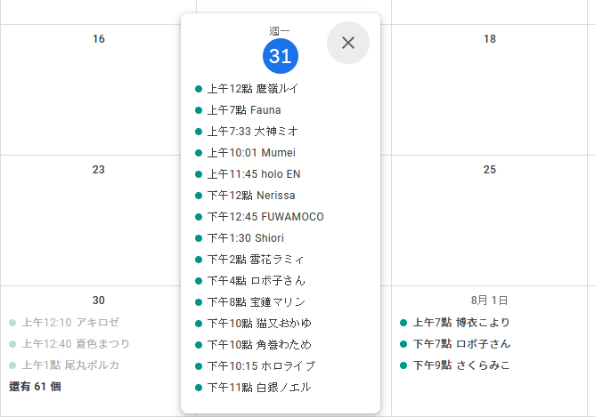
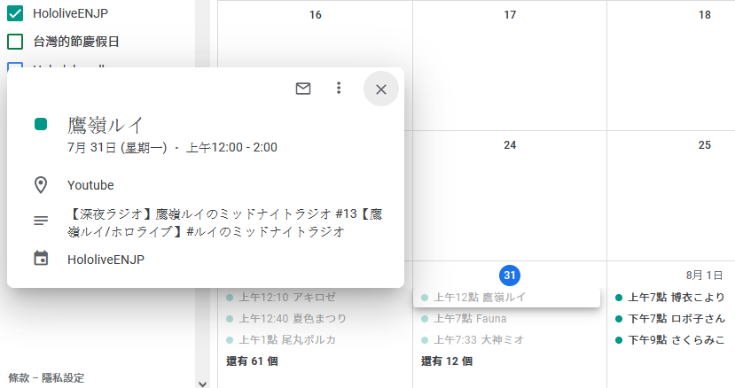
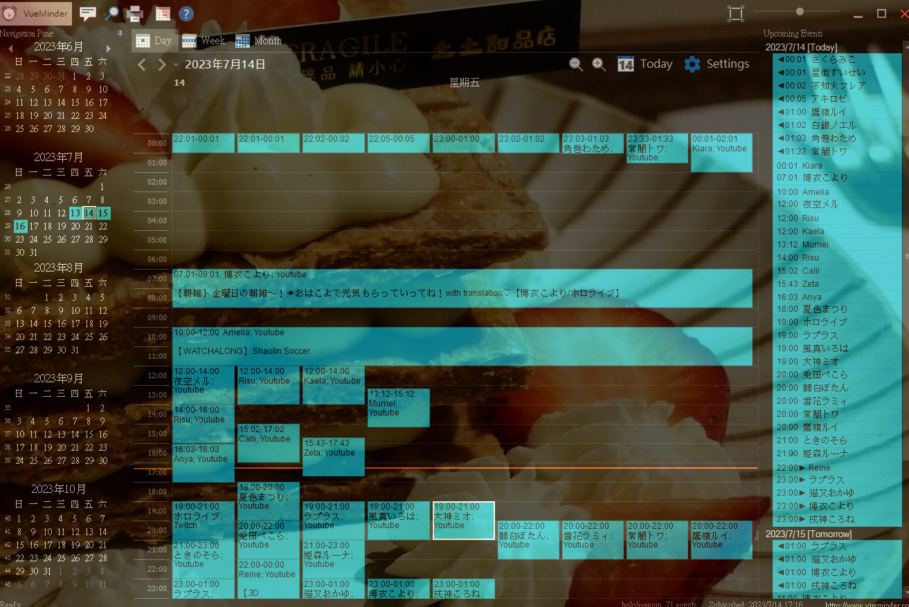
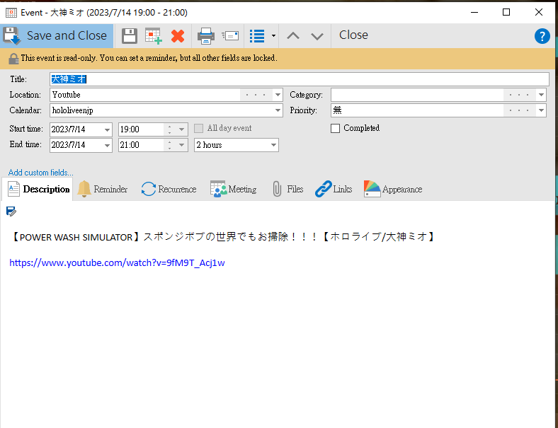

# node-holo-ics

[中文說明](README.zh-tw.md)

This is a Node.js project designed to fetch streaming schedules of talents from the Hololive API, reformat the data into iCalendar (.ics) format, and provide these .ics files through an HTTP server. With this, you can automatically fetch schedules using various calendar software that supports iCalendar, such as `Google Calendar`, `APPLE Calendar`, `VueMinder`, `Fantastical`, `Outlook`.

`Google Calendar`



`VueMinder`



Currently provided channels include:
    "holoAll"      //All hololive talents' schedules, including hololive/holostar

    "hololiveJP"

    "hololiveEN"

    "hololiveENJP"

    "hololiveID"

    "holostarAll"

    "holostarEN"
    
    "holostarJP"


The general format of the API is as follows:

``` json
{
    "dateGroupList": [
        {
            "displayDate": "06.30",
            "datetime": "2023/06/30 00:00:00",
            "videoList": [
                {
                    "displayDate": "20:01",
                    "datetime": "2023/06/30 20:01:40",
                    "isLive": false,
                    "platformType": 1,
                    "url": "https://www.youtube.com/watch?v=XWf2PqD_8zQ",
                    "thumbnail": "https://img.youtube.com/vi/XWf2PqD_8zQ/mqdefault.jpg",
                    "title": "【OFFCOLLAB】Nostalgic Games with Handcam and LAPLUS!!!!!  #kfp #キアライブ",
                    "name": "Kiara",
                    "talent": {
                        "iconImageUrl": "https://yt3.ggpht.com/w7TKJYU7zmamFmf-WxfahCo_K7Bg2__Pk-CCBNnbewMG-77OZLqJO9MLvDAmH9nEkZH8OkWgSQ=s176-c-k-c0x00ffffff-no-rj"
                    },
                    "collaboTalents": [
                        {
                            "iconImageUrl": "https://yt3.ggpht.com/roGS60A8a_lDbVakIg1JU3u3hbtjHSTilMGHMizuPKh7tuoY2nl46raxuW2f_83IKFGMjL6Z=s176-c-k-c0x00ffffff-no-rj"
                        }
                    ]
                },
                {"...":"..."}
            ]
        },
        {
            "displayDate": "07.01",
            "datetime": "2023/07/01 00:00:00",
            "videoList": [{"...":"..."}
            ]
        },
        {
            "displayDate": "07.02",
            "datetime": "2023/07/02 00:00:00",
            "videoList": [{"...":"..."}
            ]
        }
    ]
}

```

## Key Features

- Regularly fetches data from various channels using `node-cron` and updates `icsData`, which is used to generate .ics files.
- Provides an HTTP Server that returns the corresponding .ics files based on the requested path.
- Uses LokiJS DB to record the name and iconImageUrl of each talent, so you can know who the collaboTalents are (as Google Calendar does not support display).
- Puts the #hashtag in the title into the categories of ics (as Google Calendar does not support display).

## File Descriptions

- `index.js`: Main entry point of the project, containing the implementation of the HTTP server and the code for regularly updating `icsData`.
- `ics.js`: Contains the `getIcs` and `processData` functions used to fetch and process data.
- `fetchData.js`: Contains the `fetchData` function used to fetch data from the API endpoint of the given channel.
- `dbHelper.js`: Contains functions related to database operations.
- `prepareEvents.js`: Contains the function used to prepare events from the fetched data
- `config.json`: Contains the project's configuration, such as API endpoints and server port.
- `db.lokidb.example`: An example of a database file, if you want to use it, rename it to db.lokidb.
- `make_db_init.js`: Uses the content of the api (json) to initialize the database.

## How to Use

0. `mv db.lokidb.example db.lokidb` (Optional)
1. `npm install`
2. Adjust `config.json`
3. Run `node index.js` to start the server, allowing clients to access the corresponding .ics files via HTTP GET requests.
