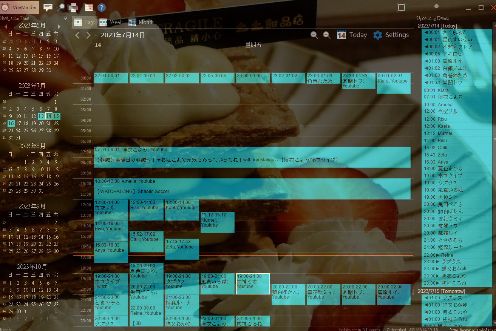
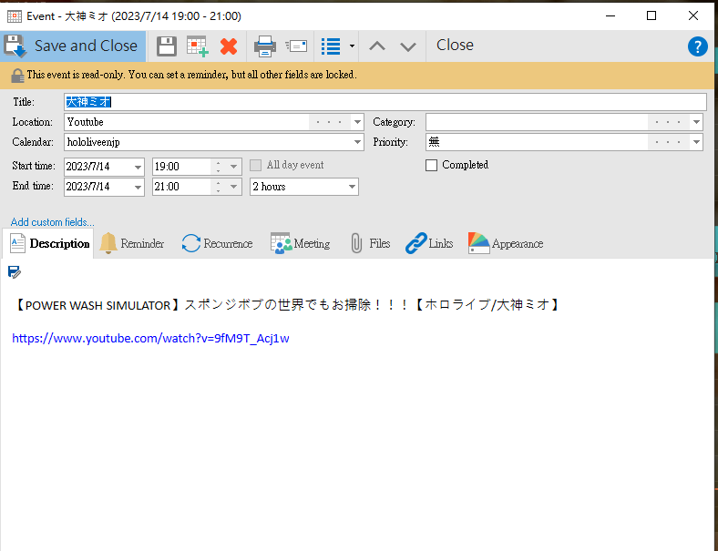

# node-holo-ics

這是一個 Node.js 專案，用於從hololive的 API 取得藝人直播排程資料，整理成 iCalendar (.ics) 格式，並且建立一個http server來提供這些 .ics 文件。
如此一來就可以使用各種支援iCalendar的月曆軟體來自動抓取行程，如: `Google Calendar`, `APPLE Calendar`, `VueMinder`, `Fantastical`, `Outlook`

`Google Calendar`


`VueMinder`




目前提供:
    "holoAll"      //所有hololive藝人排程，包含hololive/holostar

    "hololiveJP"

    "hololiveEN"

    "hololiveENJP"

    "hololiveID"

    "holostarAll"

    "holostarEN"

    "holostarJP"


API大略格式:
``` json
{
    "dateGroupList": [
        {
            "displayDate": "06.30",
            "datetime": "2023/06/30 00:00:00",
            "videoList": [
                {
                    "displayDate": "20:01",
                    "datetime": "2023/06/30 20:01:40",
                    "isLive": false,
                    "platformType": 1,
                    "url": "https://www.youtube.com/watch?v=XWf2PqD_8zQ",
                    "thumbnail": "https://img.youtube.com/vi/XWf2PqD_8zQ/mqdefault.jpg",
                    "title": "【OFFCOLLAB】Nostalgic Games with Handcam and LAPLUS!!!!!  #kfp #キアライブ",
                    "name": "Kiara",
                    "talent": {
                        "iconImageUrl": "https://yt3.ggpht.com/w7TKJYU7zmamFmf-WxfahCo_K7Bg2__Pk-CCBNnbewMG-77OZLqJO9MLvDAmH9nEkZH8OkWgSQ=s176-c-k-c0x00ffffff-no-rj"
                    },
                    "collaboTalents": [
                        {
                            "iconImageUrl": "https://yt3.ggpht.com/roGS60A8a_lDbVakIg1JU3u3hbtjHSTilMGHMizuPKh7tuoY2nl46raxuW2f_83IKFGMjL6Z=s176-c-k-c0x00ffffff-no-rj"
                        }
                    ]
                },
                {"...":"..."}
            ]
        },
        {
            "displayDate": "07.01",
            "datetime": "2023/07/01 00:00:00",
            "videoList": [{"...":"..."}
            ]
        },
        {
            "displayDate": "07.02",
            "datetime": "2023/07/02 00:00:00",
            "videoList": [{"...":"..."}
            ]
        }
    ]
}

```

## 主要功能


- 使用`node-cron`定期從各個頻道取得資料，更新 `icsData`，這些資料用於生成 .ics 文件
- 提供一個 HTTP Server，根據請求的路徑回傳對應的 .ics 文件
- 使用LokiJS db 紀錄各個talent名稱與其iconImageUrl，如此一來就可以得知collaboTalents有誰 (Google Calendar不支援顯示)
- 將標題中的#hashtag放入ics的categories中 (Google Calendar不支援顯示)

## 文件說明

- `index.js`:專案的主入口點，包含 HTTP Server的實作和定期更新 `icsData`
- `ics.js`:包含 `getIcs` 和 `processData` 兩個function，用於取得和處理資料
- `fetchData.js`:包含 `fetchData` function，用於從給定頻道的 API 端點取得資料
- `dbHelper.js`:包含與資料庫操作相關的function
- `prepareEvents.js`: 包含處理從fetchData抓取 Events 的function
- `config.json`:包含專案的配置，例如 API 端點和Server port
- `db.lokidb.example`:是一個資料庫檔案的範例，如果要使用需更名為db.lokidb
- `make_db_init.js`:使用api內容(json)初始化資料庫

## 如何使用
0. `mv db.lokidb.example db.lokidb` (Optional)
1. `npm install`
2. 調整 `config.json`
3. 執行 `node index.js` 啟動Server，就可以透過http GET得到對應的.ics
